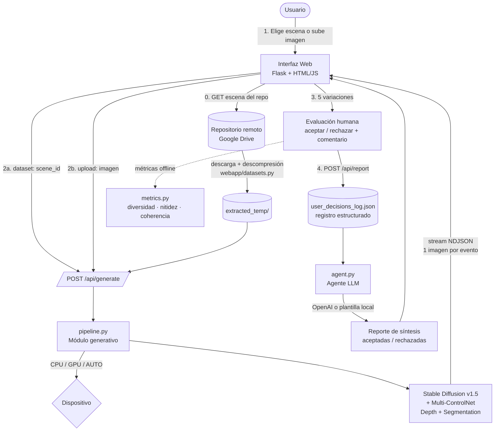

# Arquitectura del sistema

Diagrama de flujo de información y decisiones. Pegar en https://mermaid.live para exportar PNG/SVG.

## Componentes

- **Interfaz Web (`webapp/`)**: Flask sirve la SPA; API REST documentada con Swagger en `/apidocs/`.
- **Repositorio de datos (`webapp/datasets.py`)**: lista escenas de InteriorNet desde Drive, descarga y descomprime bajo demanda.
- **Módulo generativo (`pipeline.py`)**: SD 1.5 con dos ControlNet (profundidad + segmentación) en GPU/CPU; emite cada variación conforme se genera.
- **Registro de decisiones**: cada aceptación/rechazo + comentario se persiste en `user_decisions_log.json`.
- **Agente de explicabilidad (`agent.py`)**: sintetiza un reporte coherente con las decisiones (OpenAI o fallback local).
- **Evaluación (`metrics.py`)**: diversidad perceptual, nitidez y coherencia decisión↔reporte.
